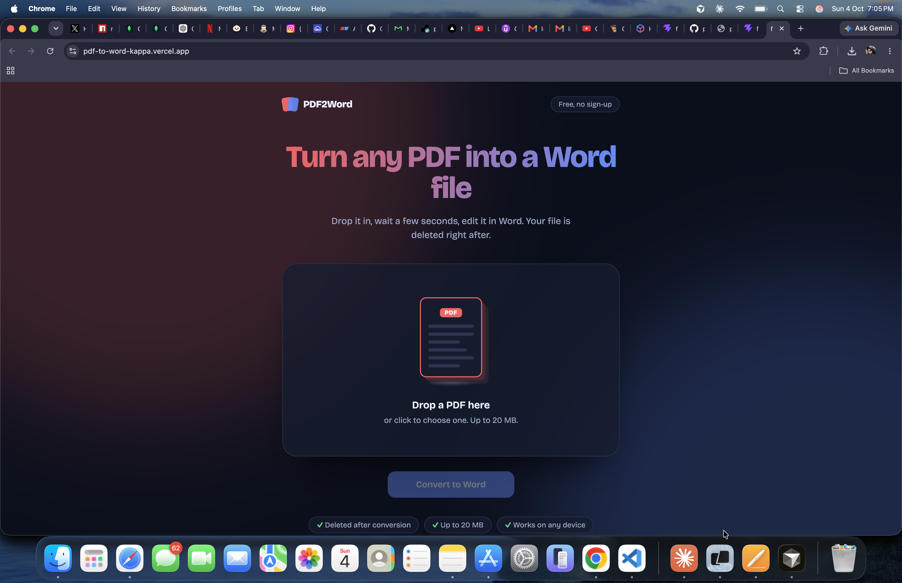

# PDF2Word

Convert a PDF into an editable Word (.docx) file in the browser. Drop a PDF in, wait a few seconds, and the .docx downloads automatically. Uploaded and converted files are deleted right after.

**Live site:** https://pdf-to-word-kappa.vercel.app



## Features

- Drag and drop upload, or click to browse
- PDF to .docx conversion that keeps text, images and basic tables
- Animated interface: the PDF sheet flips into a Word page while it converts
- Upload progress, clear error messages, and light and dark themes
- Files are deleted after conversion, and a cleanup job removes leftovers
- Works on phones and respects the reduced-motion setting

## How it works

```
Browser (React, Vercel)
   │  POST /api/convert  (multipart PDF)
   ▼
Express API (Render, Docker)
   │  validate → save temp file → run convert.py
   ▼
Python + pdf2docx  →  .docx sent back  →  temp files deleted
```

## Tech stack

| Part | Tools |
|---|---|
| Frontend | React, Vite, Axios, plain CSS |
| Backend | Node.js, Express, Multer, express-rate-limit |
| Conversion | Python, pdf2docx (PyMuPDF) |
| Hosting | Vercel (frontend), Render with Docker (backend) |

## Safety limits

- PDF files only, up to 20 MB
- 10 conversions per IP every 15 minutes
- 2 minute conversion timeout
- CORS limited to the deployed frontend

## Run it locally

You need Node 20.19 or newer and Python 3.

**Backend**

```bash
cd pdf-to-word/backend
npm install
python3 -m venv venv
source venv/bin/activate
pip install -r requirements.txt
npm run dev
```

The API starts on http://localhost:5002.

**Frontend**

```bash
cd pdf-to-word/frontend
npm install
echo "VITE_API_URL=http://localhost:5002" > .env
npm run dev
```

Open http://localhost:5173.

## Deployment

- **Backend:** Render web service using the Docker runtime, with root directory `pdf-to-word/backend` and health check path `/api/health`. Set `FRONTEND_URL` to the Vercel address.
- **Frontend:** Vercel project with root directory `pdf-to-word/frontend`. Set `VITE_API_URL` to the Render address.

## Known limitations

- The free Render instance sleeps after 15 minutes without traffic, so the first conversion after a quiet period can take about a minute longer.
- Scanned PDFs (images of text) are not supported yet. OCR is planned.
- Complex layouts may not match the original PDF exactly.

## Roadmap

- OCR for scanned PDFs
- Batch conversion of several PDFs
- Other PDF tools: merge, split, compress, PDF to images